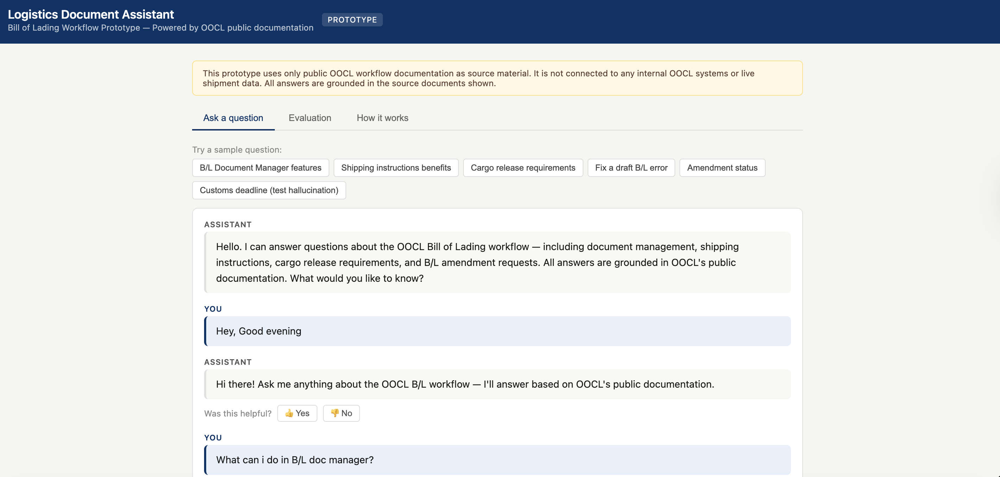
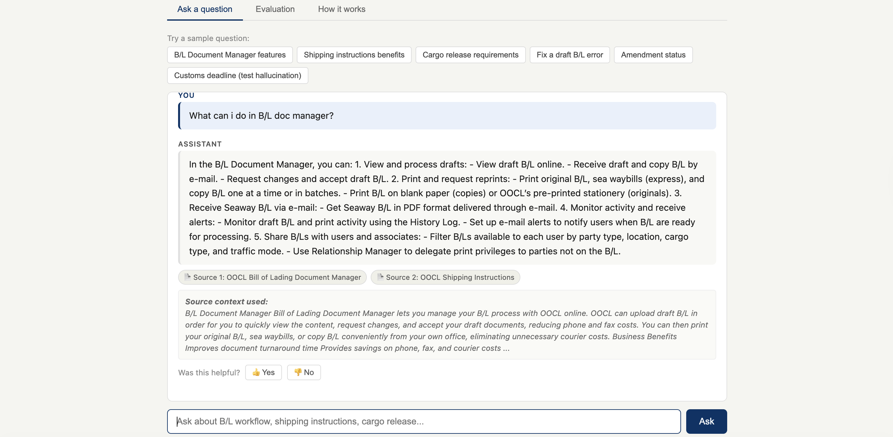

# OOCL B/L Assistant — RAG Prototype

A Retrieval-Augmented Generation (RAG) prototype built on public OOCL workflow documentation. Users can ask questions about the Bill of Lading process and get grounded, source-verified answers.

Built proactively to demonstrate applied AI thinking for a logistics domain.

---

## Demo




---

## What it does

- Answers questions about the OOCL B/L workflow (document management, shipping instructions, cargo release, amendment requests)
- Retrieves the most relevant source chunks using keyword-based retrieval with fuzzy matching for typo tolerance
- Generates answers using GPT-4o-mini, grounded strictly in the retrieved source context
- Refuses to guess — if the source doesn't contain the answer, it says so
- Tracks user feedback (helpful / not helpful) per answer
- Includes a full evaluation suite with 6 behavioral test questions (100% grounding rate)

---

## Source documents

- OOCL B/L Document Manager (public page)
- OOCL Shipping Instructions (public page)
- OOCL USA Import Procedures (public page)
- OOCL B/L Amendment Request guide (public PDF)

> This prototype uses only public OOCL documentation. It is not affiliated with OOCL, not connected to internal OOCL systems, and does not use live shipment data.

---

## Tech stack

| Layer | Technology |
|---|---|
| Backend | Python, FastAPI |
| Retrieval | Keyword scoring + fuzzy token matching (difflib) |
| Answer generation | OpenAI GPT-4o-mini |
| Frontend | Plain HTML/CSS/JS (no framework) |

---

## Setup

### 1. Install dependencies
```bash
pip install fastapi uvicorn openai python-multipart
```

### 2. Set your OpenAI API key
```bash
export OPENAI_API_KEY=your_key_here
```

### 3. Run the backend
```bash
cd backend
python3 -m uvicorn main:app --port 8000 --reload
```

### 4. Serve the frontend
```bash
cd frontend
python3 -m http.server 3000
```

Open **http://localhost:3000** in your browser.

> Note: The app works without an OpenAI API key using the built-in extractive fallback — answers are keyword-matched from pre-written grounded responses.

---

## API Endpoints

| Method | Endpoint | Description |
|---|---|---|
| POST | `/ask` | Ask a question, get a grounded answer with source chunks |
| GET | `/evaluate` | Run all 6 test questions and see grounding results |
| POST | `/feedback` | Submit helpful / not helpful feedback |
| GET | `/feedback/summary` | See overall feedback stats |

---

## Evaluation

6 test questions covering:
- B/L Document Manager features
- Online shipping instructions benefits
- Import cargo release requirements
- Delay and demurrage causes
- Hallucination resistance (question the source cannot answer)
- Draft B/L error correction workflow

**Result: 6/6 grounded on the evaluation set**

---

## Design decisions

- **Keyword retrieval over vector embeddings** — the corpus is 13 chunks; dense embeddings add a 500MB dependency with no measurable accuracy gain at this scale
- **Fuzzy token matching** — handles typos without external spell-check libraries by matching query tokens against the known chunk vocabulary
- **Conversation memory** — short follow-up questions use the previous grounded Q&A as context, while new logistics topics are treated as fresh queries
- **Short query expansion** — topic-only inputs like "customs", "fees", or "BL docs" are expanded into complete search questions before retrieval
- **Hallucination gate** — `context_has_enough_signal()` checks token overlap before calling OpenAI; the system prompt enforces source-only answers
- **Extractive fallback** — the app is fully demoable without an API key

---

## What's next

- Switch retrieval to dense embeddings (sentence-transformers) if the corpus grows beyond ~50 chunks
- Add multi-turn conversation history using OpenAI's messages array instead of single prior Q&A injection
- Expand the knowledge base to cover more OOCL workflows (freight rates, container tracking)
- Add a confidence score to each answer based on retrieval overlap strength

---

## Project structure

```
oocl-bl-assistant/
├── backend/
│   └── main.py          # FastAPI app — retrieval, chunking, evaluation, feedback
├── data/
│   └── oocl_public_workflow_notes.md   # Knowledge base (4 sources)
├── evaluation/
│   └── test_questions.csv              # 6 behavioral test questions
├── frontend/
│   └── index.html       # Single-file UI — Ask, Evaluation, How it works tabs
└── requirements.txt
```
